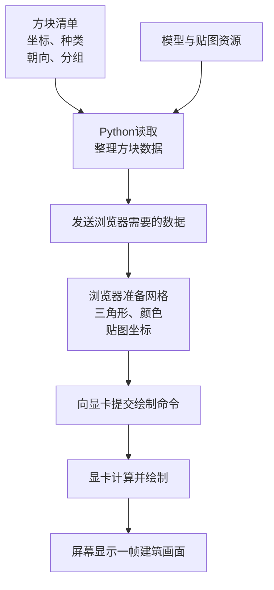

# 00：屏幕里的建筑是怎样画出来的 · 图1

对应[说明文档](../../docs/rendering-guide/00-start-here.md)。箭头表示步骤或依赖，具体读法见正文。

```mermaid
flowchart TD
    blockList["方块清单<br/>坐标、种类<br/>朝向、分组"] --> backend["Python读取<br/>整理方块数据"]
    resources["模型与贴图资源"] --> backend
    backend --> packet["发送浏览器需要的数据"]
    packet --> meshes["浏览器准备网格<br/>三角形、颜色<br/>贴图坐标"]
    meshes --> drawCommands["向显卡提交绘制命令"]
    drawCommands --> gpu["显卡计算并绘制"]
    gpu --> picture["屏幕显示一帧建筑画面"]
```
