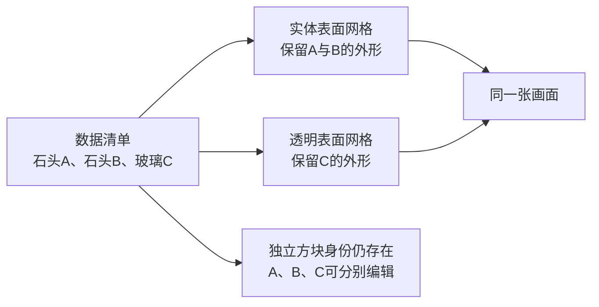

# 00：屏幕里的建筑是怎样画出来的 · 图2

对应[说明文档](../../docs/rendering-guide/00-start-here.md)。箭头表示步骤或依赖，具体读法见正文。

```mermaid
flowchart LR
    cells["数据清单<br/>石头A、石头B、玻璃C"] --> opaque["实体表面网格<br/>保留A与B的外形"]
    cells --> glass["透明表面网格<br/>保留C的外形"]
    opaque --> picture["同一张画面"]
    glass --> picture
    cells --> editing["独立方块身份仍存在<br/>A、B、C可分别编辑"]
```
