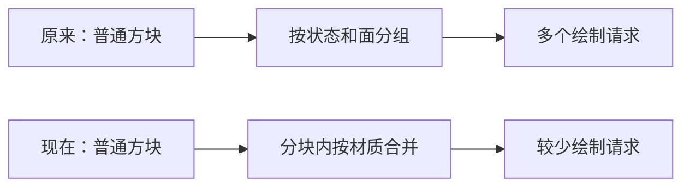

# 01：把普通方块按材质合批绘制 · 图1

对应[说明文档](../../docs/rendering-guide/01-opaque-batching.md)。箭头表示步骤或依赖，具体读法见正文。

```mermaid
flowchart LR
  OldCells["原来：普通方块"] --> OldKinds["按状态和面分组"]
  OldKinds --> OldDraw["多个绘制请求"]
  NewCells["现在：普通方块"] --> NewMaterial["分块内按材质合并"]
  NewMaterial --> NewDraw["较少绘制请求"]
```
