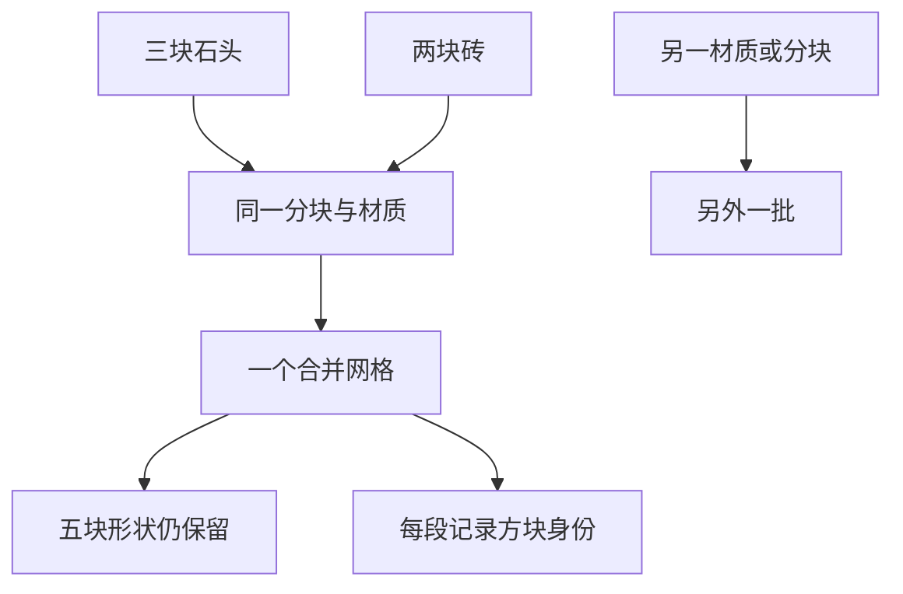

# 01：把普通方块按材质合批绘制 · 图2

对应[说明文档](../../docs/rendering-guide/01-opaque-batching.md)。箭头表示步骤或依赖，具体读法见正文。

```mermaid
flowchart TD
  Stone["三块石头"] --> Shared["同一分块与材质"]
  Brick["两块砖"] --> Shared
  Shared --> Mesh["一个合并网格"]
  Mesh --> Geometry["五块形状仍保留"]
  Mesh --> Owners["每段记录方块身份"]
  Other["另一材质或分块"] --> Separate["另外一批"]
```
