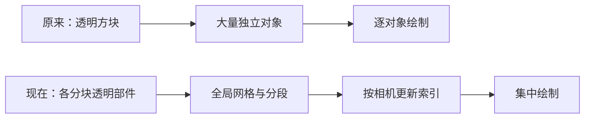

# 02：让半透明表面按远近排队 · 图1

对应[说明文档](../../docs/rendering-guide/02-transparent-order.md)。箭头表示步骤或依赖，具体读法见正文。

```mermaid
flowchart LR
  OldParts["原来：透明方块"] --> OldObjects["大量独立对象"]
  OldObjects --> OldDraw["逐对象绘制"]
  NewParts["现在：各分块透明部件"] --> NewMesh["全局网格与分段"]
  NewMesh --> NewOrder["按相机更新索引"]
  NewOrder --> NewDraw["集中绘制"]
```
