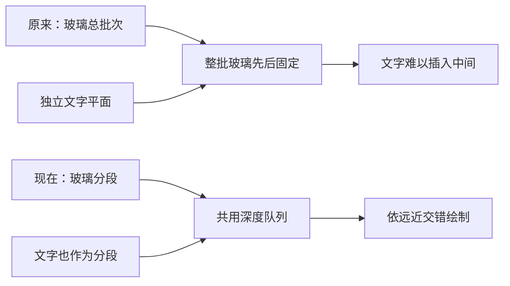

# 03：让字牌文字与玻璃共享排序 · 图1

对应[说明文档](../../docs/rendering-guide/03-sign-order.md)。箭头表示步骤或依赖，具体读法见正文。

```mermaid
flowchart LR
  OldGlass["原来：玻璃总批次"] --> OldDraw["整批玻璃先后固定"]
  OldText["独立文字平面"] --> OldDraw
  OldDraw --> Wrong["文字难以插入中间"]
  NewGlass["现在：玻璃分段"] --> Queue["共用深度队列"]
  NewText["文字也作为分段"] --> Queue
  Queue --> Right["依远近交错绘制"]
```
