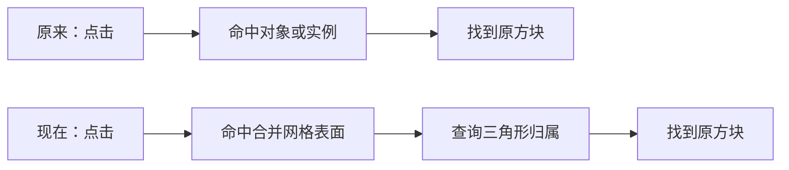

# 04：合批后仍能点中原来的方块 · 图1

对应[说明文档](../../docs/rendering-guide/04-block-picking.md)。箭头表示步骤或依赖，具体读法见正文。

```mermaid
flowchart LR
  OldClick["原来：点击"] --> OldObject["命中对象或实例"]
  OldObject --> OldCell["找到原方块"]
  NewClick["现在：点击"] --> NewTriangle["命中合并网格表面"]
  NewTriangle --> Ownership["查询三角形归属"]
  Ownership --> NewCell["找到原方块"]
```
