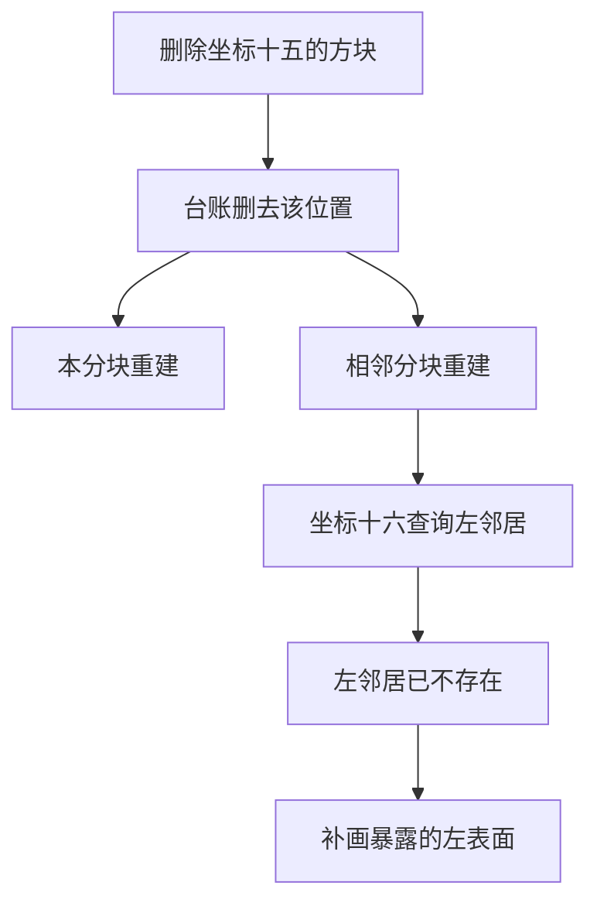

# 05：只更新发生变化的位置索引 · 图2

对应[说明文档](../../docs/rendering-guide/05-incremental-occupancy.md)。箭头表示步骤或依赖，具体读法见正文。

```mermaid
flowchart TD
  Delete["删除坐标十五的方块"] --> Map["台账删去该位置"]
  Map --> Own["本分块重建"]
  Map --> Neighbor["相邻分块重建"]
  Neighbor --> Query["坐标十六查询左邻居"]
  Query --> Missing["左邻居已不存在"]
  Missing --> Face["补画暴露的左表面"]
```
