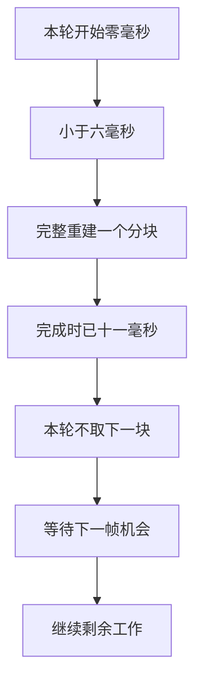

# 07：把几何重建分散到多帧 · 图2

对应[说明文档](../../docs/rendering-guide/07-frame-budget.md)。箭头表示步骤或依赖，具体读法见正文。

```mermaid
flowchart TD
  Start["本轮开始零毫秒"] --> Check["小于六毫秒"]
  Check --> Chunk["完整重建一个分块"]
  Chunk --> Eleven["完成时已十一毫秒"]
  Eleven --> Stop["本轮不取下一块"]
  Stop --> Yield["等待下一帧机会"]
  Yield --> Next["继续剩余工作"]
```
