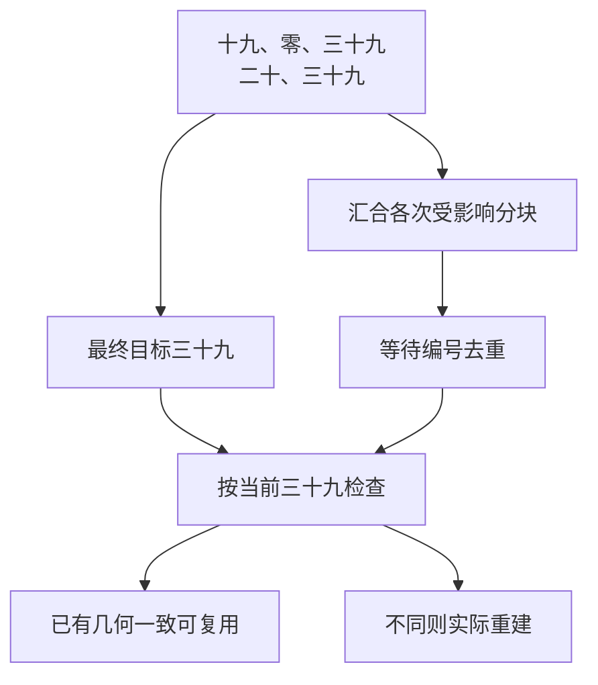

# 08：连续切层时使用最新目标 · 图2

对应[说明文档](../../docs/rendering-guide/08-latest-input.md)。箭头表示步骤或依赖，具体读法见正文。

```mermaid
flowchart TD
  Inputs["十九、零、三十九<br/>二十、三十九"] --> Target["最终目标三十九"]
  Inputs --> Pending["汇合各次受影响分块"]
  Pending --> Unique["等待编号去重"]
  Target --> Rebuild["按当前三十九检查"]
  Unique --> Rebuild
  Rebuild --> Match["已有几何一致可复用"]
  Rebuild --> Changed["不同则实际重建"]
```
