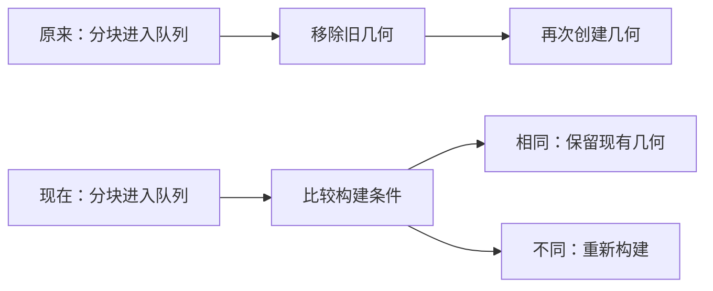

# 09：变化条件相同时复用已有几何 · 图1

对应[说明文档](../../docs/rendering-guide/09-mesh-version-reuse.md)。箭头表示步骤或依赖，具体读法见正文。

```mermaid
flowchart LR
  OldQueue["原来：分块进入队列"] --> OldRemove["移除旧几何"]
  OldRemove --> OldBuild["再次创建几何"]
  NewQueue["现在：分块进入队列"] --> Key["比较构建条件"]
  Key --> Same["相同：保留现有几何"]
  Key --> Different["不同：重新构建"]
```
