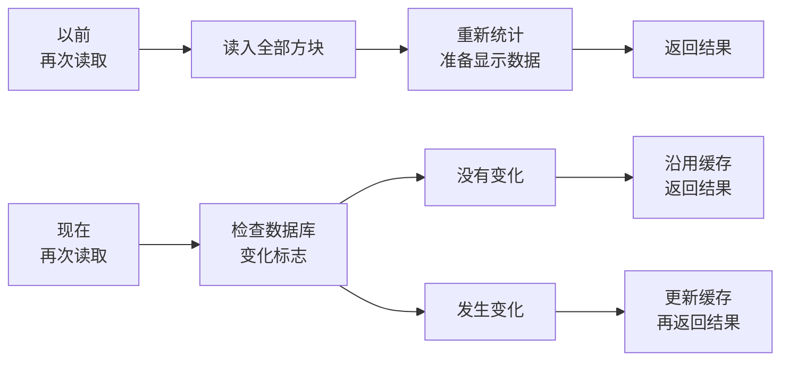

# 11 · 场景没变，就沿用已经整理好的结果 · 图1

对应[说明文档](../../docs/rendering-guide/11-backend-read-cache.md)。箭头表示步骤或依赖，具体读法见正文。

```mermaid
flowchart LR
    oldRequest["以前<br/>再次读取"] --> oldLoad["读入全部方块"]
    oldLoad --> oldPrepare["重新统计<br/>准备显示数据"]
    oldPrepare --> oldReply["返回结果"]
    newRequest["现在<br/>再次读取"] --> newCheck["检查数据库<br/>变化标志"]
    newCheck --> newSame["没有变化"]
    newSame --> newReuse["沿用缓存<br/>返回结果"]
    newCheck --> newChanged["发生变化"]
    newChanged --> newRefresh["更新缓存<br/>再返回结果"]
```
