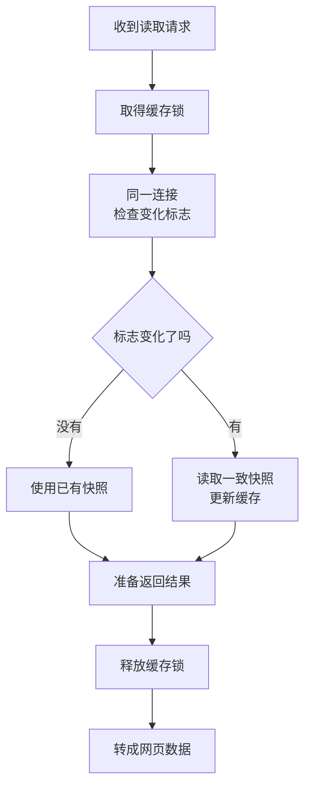

# 11 · 场景没变，就沿用已经整理好的结果 · 图2

对应[说明文档](../../docs/rendering-guide/11-backend-read-cache.md)。箭头表示步骤或依赖，具体读法见正文。

```mermaid
flowchart TD
    request["收到读取请求"] --> lock["取得缓存锁"]
    lock --> observe["同一连接<br/>检查变化标志"]
    observe --> decision{"标志变化了吗"}
    decision -->|"没有"| reuse["使用已有快照"]
    decision -->|"有"| snapshot["读取一致快照<br/>更新缓存"]
    reuse --> result["准备返回结果"]
    snapshot --> result
    result --> release["释放缓存锁"]
    release --> serialize["转成网页数据"]
```
