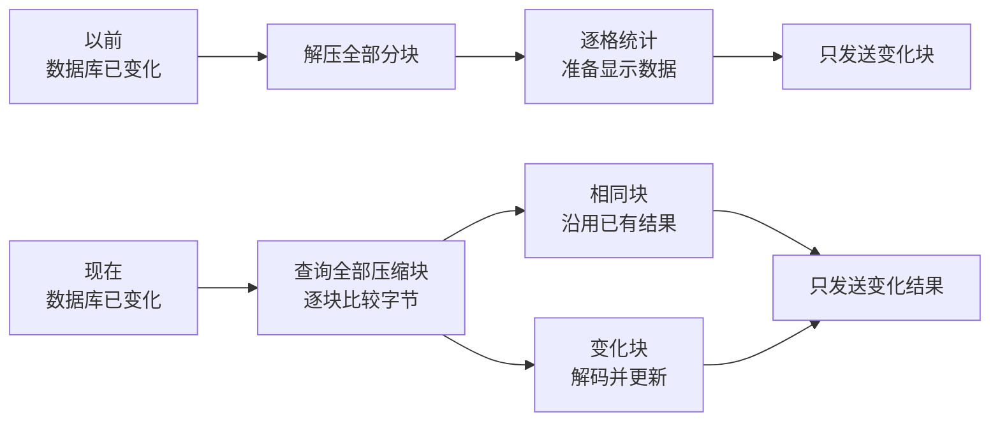

# 12 · 数据库变了，只拆开真正变化的分块 · 图1

对应[说明文档](../../docs/rendering-guide/12-chunk-decode-cache.md)。箭头表示步骤或依赖，具体读法见正文。

```mermaid
flowchart LR
    oldRead["以前<br/>数据库已变化"] --> oldDecode["解压全部分块"]
    oldDecode --> oldCells["逐格统计<br/>准备显示数据"]
    oldCells --> oldSend["只发送变化块"]
    newRead["现在<br/>数据库已变化"] --> compare["查询全部压缩块<br/>逐块比较字节"]
    compare --> same["相同块<br/>沿用已有结果"]
    compare --> different["变化块<br/>解码并更新"]
    same --> newSend["只发送变化结果"]
    different --> newSend
```
