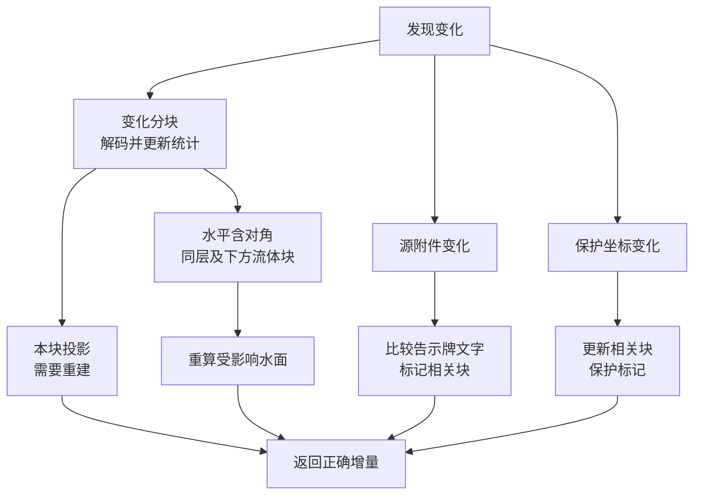

# 12 · 数据库变了，只拆开真正变化的分块 · 图2

对应[说明文档](../../docs/rendering-guide/12-chunk-decode-cache.md)。箭头表示步骤或依赖，具体读法见正文。

```mermaid
flowchart TD
    change["发现变化"] --> blocks["变化分块<br/>解码并更新统计"]
    blocks --> own["本块投影<br/>需要重建"]
    blocks --> fluid["水平含对角<br/>同层及下方流体块"]
    fluid --> surface["重算受影响水面"]
    change --> attachment["源附件变化"]
    attachment --> signs["比较告示牌文字<br/>标记相关块"]
    change --> protection["保护坐标变化"]
    protection --> markers["更新相关块<br/>保护标记"]
    own --> reply["返回正确增量"]
    surface --> reply
    signs --> reply
    markers --> reply
```
