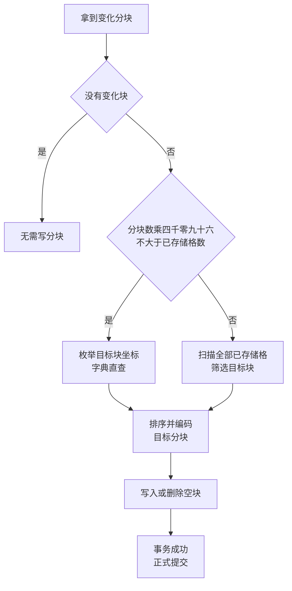

# 13 · 保存局部修改时，直接寻找附近坐标 · 图2

对应[说明文档](../../docs/rendering-guide/13-local-chunk-write.md)。箭头表示步骤或依赖，具体读法见正文。

```mermaid
flowchart TD
    keys["拿到变化分块"] --> empty{"没有变化块"}
    empty -->|"是"| finish["无需写分块"]
    empty -->|"否"| cost{"分块数乘四千零九十六<br/>不大于已存储格数"}
    cost -->|"是"| lookup["枚举目标块坐标<br/>字典直查"]
    cost -->|"否"| scan["扫描全部已存储格<br/>筛选目标块"]
    lookup --> encode["排序并编码<br/>目标分块"]
    scan --> encode
    encode --> write["写入或删除空块"]
    write --> commit["事务成功<br/>正式提交"]
```
