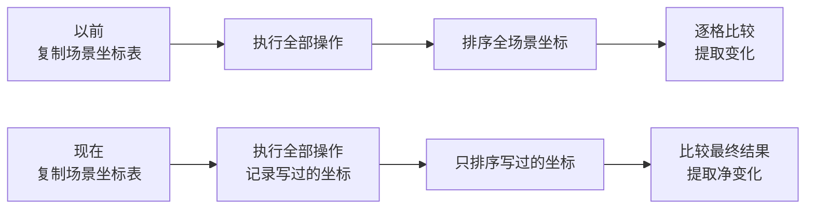

# 14 · 记住碰过哪些坐标，只比较最后的净变化 · 图1

对应[说明文档](../../docs/rendering-guide/14-edit-net-delta.md)。箭头表示步骤或依赖，具体读法见正文。

```mermaid
flowchart LR
    oldStart["以前<br/>复制场景坐标表"] --> oldRun["执行全部操作"]
    oldRun --> oldSort["排序全场景坐标"]
    oldSort --> oldDiff["逐格比较<br/>提取变化"]
    newStart["现在<br/>复制场景坐标表"] --> newRun["执行全部操作<br/>记录写过的坐标"]
    newRun --> newSort["只排序写过的坐标"]
    newSort --> newDiff["比较最终结果<br/>提取净变化"]
```
