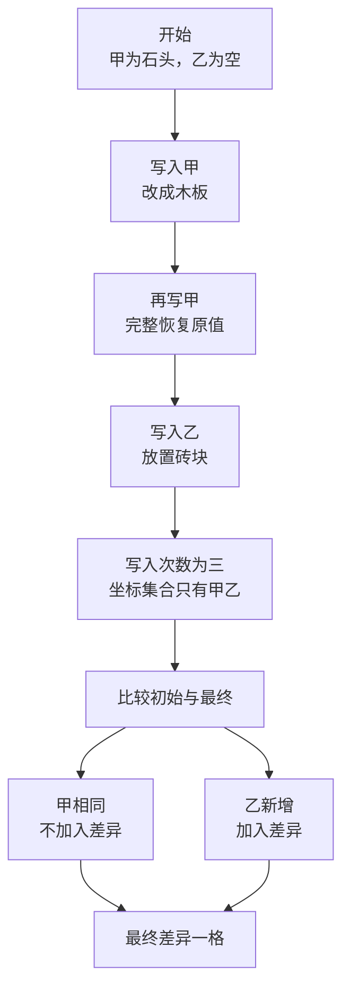

# 14 · 记住碰过哪些坐标，只比较最后的净变化 · 图2

对应[说明文档](../../docs/rendering-guide/14-edit-net-delta.md)。箭头表示步骤或依赖，具体读法见正文。

```mermaid
flowchart TD
    before["开始<br/>甲为石头，乙为空"] --> first["写入甲<br/>改成木板"]
    first --> second["再写甲<br/>完整恢复原值"]
    second --> third["写入乙<br/>放置砖块"]
    third --> touched["写入次数为三<br/>坐标集合只有甲乙"]
    touched --> compare["比较初始与最终"]
    compare --> unchanged["甲相同<br/>不加入差异"]
    compare --> added["乙新增<br/>加入差异"]
    unchanged --> result["最终差异一格"]
    added --> result
```
