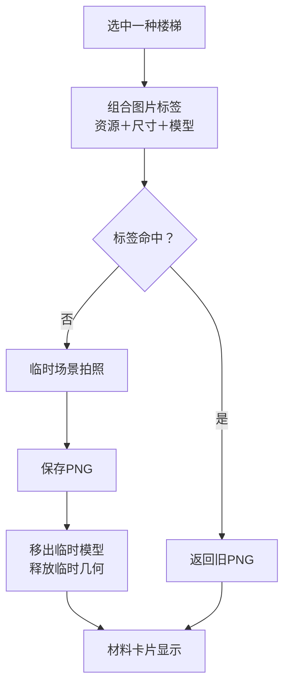

# 15｜独立缩略图：小照片有自己的摄影棚 · 图2

对应[说明文档](../../docs/rendering-guide/15-independent-thumbnails.md)。箭头表示步骤或依赖，具体读法见正文。

```mermaid
flowchart TD
    choose["选中一种楼梯"] --> label["组合图片标签<br/>资源＋尺寸＋模型"]
    label --> find{"标签命中？"}
    find -->|"是"| reuse["返回旧PNG"]
    find -->|"否"| draw["临时场景拍照"]
    draw --> save["保存PNG"]
    save --> clean["移出临时模型<br/>释放临时几何"]
    clean --> show["材料卡片显示"]
    reuse --> show
```
