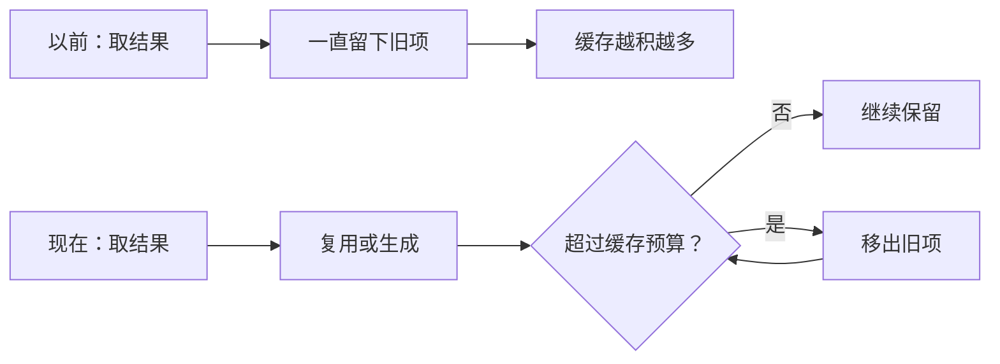

# 16｜有界缓存：架子要有容量，也要会腾位置 · 图1

对应[说明文档](../../docs/rendering-guide/16-bounded-caches.md)。箭头表示步骤或依赖，具体读法见正文。

```mermaid
flowchart LR
    oldRead["以前：取结果"] --> oldKeep["一直留下旧项"]
    oldKeep --> oldGrow["缓存越积越多"]
    newRead["现在：取结果"] --> newKeep["复用或生成"]
    newKeep --> budget{"超过缓存预算？"}
    budget -->|"否"| retain["继续保留"]
    budget -->|"是"| evict["移出旧项"]
    evict --> budget
```
