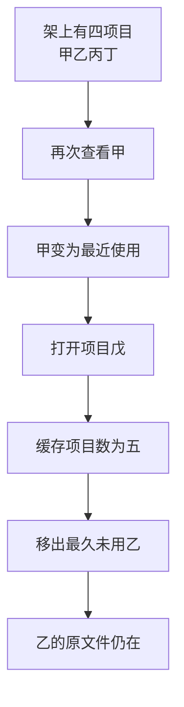

# 16｜有界缓存：架子要有容量，也要会腾位置 · 图2

对应[说明文档](../../docs/rendering-guide/16-bounded-caches.md)。箭头表示步骤或依赖，具体读法见正文。

```mermaid
flowchart TD
    four["架上有四项目<br/>甲乙丙丁"] --> touch["再次查看甲"]
    touch --> recent["甲变为最近使用"]
    recent --> fifth["打开项目戊"]
    fifth --> exceed["缓存项目数为五"]
    exceed --> remove["移出最久未用乙"]
    remove --> source["乙的原文件仍在"]
```
