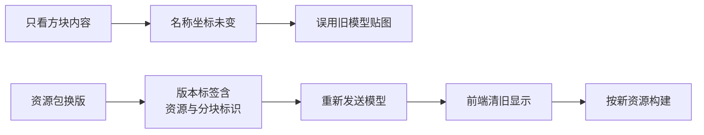

# 17｜资源失效：材料换版，旧说明书也要换 · 图1

对应[说明文档](../../docs/rendering-guide/17-resource-invalidation.md)。箭头表示步骤或依赖，具体读法见正文。

```mermaid
flowchart LR
    oldName["只看方块内容"] --> oldSame["名称坐标未变"]
    oldSame --> oldSkip["误用旧模型贴图"]
    pack["资源包换版"] --> token["版本标签含<br/>资源与分块标识"]
    token --> resend["重新发送模型"]
    resend --> clear["前端清旧显示"]
    clear --> rebuild["按新资源构建"]
```
