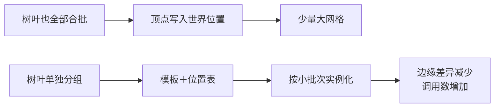

# 18｜树叶实例化：特殊材料保留合适的摆放方式 · 图1

对应[说明文档](../../docs/rendering-guide/18-leaf-instancing.md)。箭头表示步骤或依赖，具体读法见正文。

```mermaid
flowchart LR
    oldLeaf["树叶也全部合批"] --> oldWorld["顶点写入世界位置"]
    oldWorld --> oldMesh["少量大网格"]
    newLeaf["树叶单独分组"] --> template["模板＋位置表"]
    template --> instances["按小批次实例化"]
    instances --> quality["边缘差异减少<br/>调用数增加"]
```
