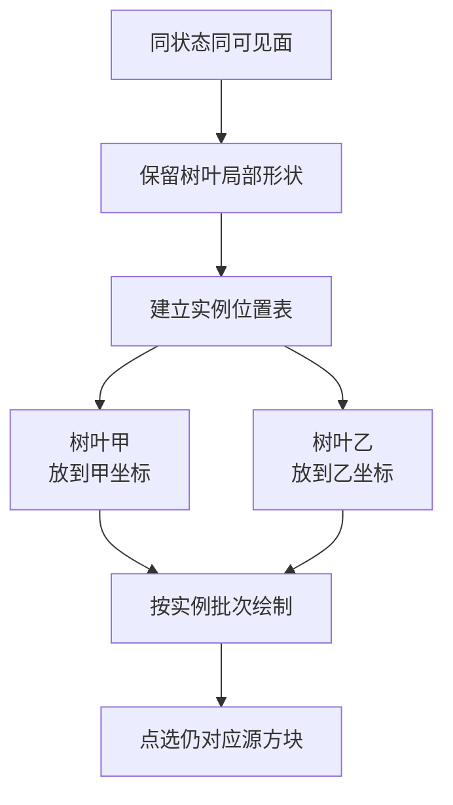

# 18｜树叶实例化：特殊材料保留合适的摆放方式 · 图2

对应[说明文档](../../docs/rendering-guide/18-leaf-instancing.md)。箭头表示步骤或依赖，具体读法见正文。

```mermaid
flowchart TD
    group["同状态同可见面"] --> shape["保留树叶局部形状"]
    shape --> table["建立实例位置表"]
    table --> leafOne["树叶甲<br/>放到甲坐标"]
    table --> leafTwo["树叶乙<br/>放到乙坐标"]
    leafOne --> draw["按实例批次绘制"]
    leafTwo --> draw
    draw --> owner["点选仍对应源方块"]
```
