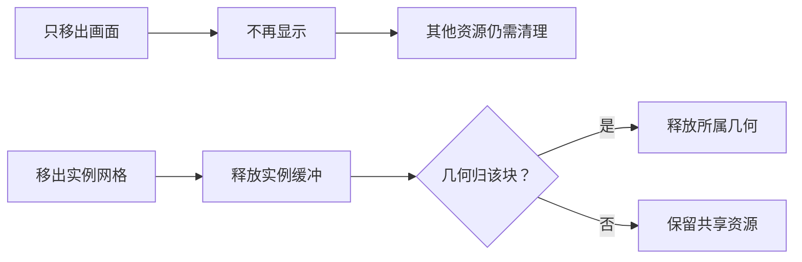

# 19｜缓冲生命周期：谁申请的设备，谁负责收好 · 图1

对应[说明文档](../../docs/rendering-guide/19-gpu-buffer-lifetime.md)。箭头表示步骤或依赖，具体读法见正文。

```mermaid
flowchart LR
    oldRemove["只移出画面"] --> oldHidden["不再显示"]
    oldHidden --> oldHeld["其他资源仍需清理"]
    newRemove["移出实例网格"] --> releaseInstance["释放实例缓冲"]
    releaseInstance --> owned{"几何归该块？"}
    owned -->|"是"| releaseShape["释放所属几何"]
    owned -->|"否"| keepShared["保留共享资源"]
```
