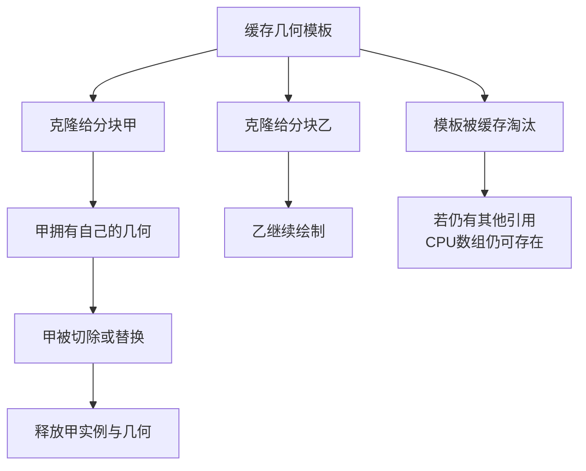

# 19｜缓冲生命周期：谁申请的设备，谁负责收好 · 图2

对应[说明文档](../../docs/rendering-guide/19-gpu-buffer-lifetime.md)。箭头表示步骤或依赖，具体读法见正文。

```mermaid
flowchart TD
    cache["缓存几何模板"] --> cloneOne["克隆给分块甲"]
    cache --> cloneTwo["克隆给分块乙"]
    cloneOne --> useOne["甲拥有自己的几何"]
    cloneTwo --> useTwo["乙继续绘制"]
    useOne --> removeOne["甲被切除或替换"]
    removeOne --> disposeOne["释放甲实例与几何"]
    cache --> eviction["模板被缓存淘汰"]
    eviction --> remaining["若仍有其他引用<br/>CPU数组仍可存在"]
```
