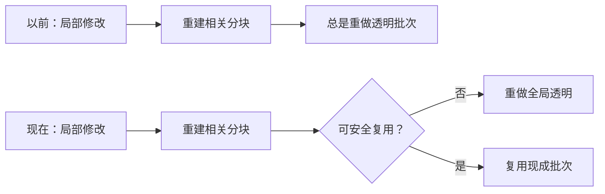

# 20｜透明批次复用：没有动到窗户，就别重做整套窗户 · 图1

对应[说明文档](../../docs/rendering-guide/20-transparent-reuse.md)。箭头表示步骤或依赖，具体读法见正文。

```mermaid
flowchart LR
    oldEdit["以前：局部修改"] --> oldChunk["重建相关分块"]
    oldChunk --> oldFlush["总是重做透明批次"]
    newEdit["现在：局部修改"] --> newChunk["重建相关分块"]
    newChunk --> compare{"可安全复用？"}
    compare -->|"否"| rebuild["重做全局透明"]
    compare -->|"是"| reuse["复用现成批次"]
```
