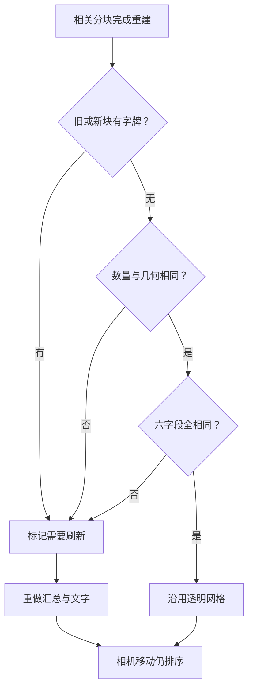

# 20｜透明批次复用：没有动到窗户，就别重做整套窗户 · 图2

对应[说明文档](../../docs/rendering-guide/20-transparent-reuse.md)。箭头表示步骤或依赖，具体读法见正文。

```mermaid
flowchart TD
    change["相关分块完成重建"] --> texts{"旧或新块有字牌？"}
    texts -->|"有"| dirty["标记需要刷新"]
    texts -->|"无"| parts{"数量与几何相同？"}
    parts -->|"否"| dirty
    parts -->|"是"| fields{"六字段全相同？"}
    fields -->|"否"| dirty
    fields -->|"是"| keep["沿用透明网格"]
    dirty --> flush["重做汇总与文字"]
    keep --> sort["相机移动仍排序"]
    flush --> sort
```
