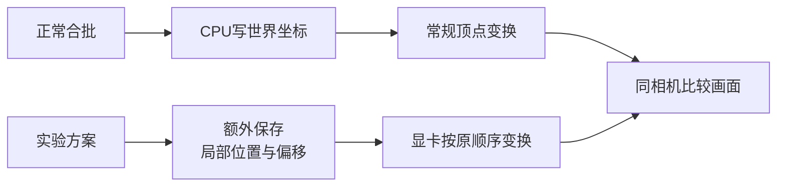

# 21｜回退的顶点着色器：花更多内存，画面却没明显改善 · 图1

对应[说明文档](../../docs/rendering-guide/21-rejected-vertex-shader.md)。箭头表示步骤或依赖，具体读法见正文。

```mermaid
flowchart LR
    original["正常合批"] --> cpuWorld["CPU写世界坐标"]
    cpuWorld --> usualShader["常规顶点变换"]
    attempt["实验方案"] --> extra["额外保存<br/>局部位置与偏移"]
    extra --> customShader["显卡按原顺序变换"]
    usualShader --> compare["同相机比较画面"]
    customShader --> compare
```
