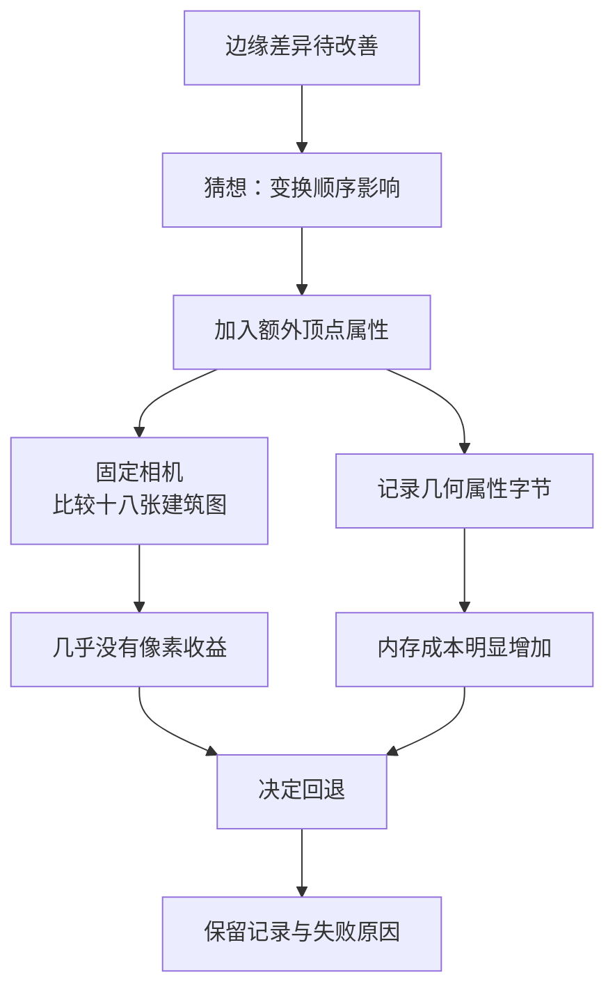

# 21｜回退的顶点着色器：花更多内存，画面却没明显改善 · 图2

对应[说明文档](../../docs/rendering-guide/21-rejected-vertex-shader.md)。箭头表示步骤或依赖，具体读法见正文。

```mermaid
flowchart TD
    question["边缘差异待改善"] --> hypothesis["猜想：变换顺序影响"]
    hypothesis --> prototype["加入额外顶点属性"]
    prototype --> photos["固定相机<br/>比较十八张建筑图"]
    prototype --> memory["记录几何属性字节"]
    photos --> evidence["几乎没有像素收益"]
    memory --> cost["内存成本明显增加"]
    evidence --> decision["决定回退"]
    cost --> decision
    decision --> record["保留记录与失败原因"]
```
